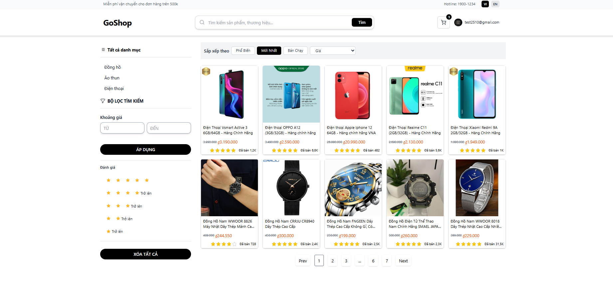

# 🛒 GoShop - Website Mua Sắm Trực Tuyến



> **Tác giả:** Nguyễn Tấn Minh  
> **Email:** tanminh.office183@gmail.com > **GitHub:** https://github.com/minhnt2510

GoShop là một ứng dụng web thương mại điện tử được xây dựng bằng **React + Vite + TypeScript**, với mục tiêu mang đến trải nghiệm mua sắm trực tuyến hiện đại, tiện lợi và thân thiện với người dùng.

---

## 🚀 Tính năng nổi bật

### 🔑 Authentication (JWT)

- Đăng ký tài khoản
- Đăng nhập
- Đăng xuất

### 🛍️ Trang danh sách sản phẩm

- Phân trang (Pagination)
- Sắp xếp theo thuộc tính sản phẩm (Sort)
- Lọc nâng cao theo nhiều thuộc tính (Filter)
- Tìm kiếm sản phẩm

### 📦 Trang chi tiết sản phẩm

- Hiển thị thông tin chi tiết sản phẩm
- Hình ảnh dạng **slider + hover zoom effect**
- Mô tả sản phẩm dạng **WYSIWYG HTML Rich Text**
- Chức năng mua hàng trực tiếp

### 🛒 Giỏ hàng

- Quản lý đơn hàng: **Thêm / Sửa / Xóa sản phẩm**
- Thực hiện đặt hàng

### 👤 Quản lý Profile khách hàng

- Cập nhật thông tin cá nhân
- Upload Avatar
- Đổi mật khẩu
- Theo dõi tình trạng đơn hàng

---

## 🛠️ Công nghệ sử dụng

- **UI / CSS:** TailwindCSS + HeadlessUI
- **State Management:** React Query (async state) + React Context (state thường)
- **Form Management:** React Hook Form
- **Routing:** React Router
- **Build Tool:** Vite
- **API:** REST API
- **Đa ngôn ngữ:** react.i18next
- **SEO:** React Helmet
- **Storybook:** Mô hình hóa và demo component
- **Unit Test:** Vitest

---

## ⚙️ Cài đặt dự án

### 1. Clone project

```bash
git clone https://github.com/minhnt2510/Shopbanhang.git
cd GoShop
npm install
npm run dev
```

📜 License
Dự án được phát triển với mục đích học tập và nghiên cứu.
